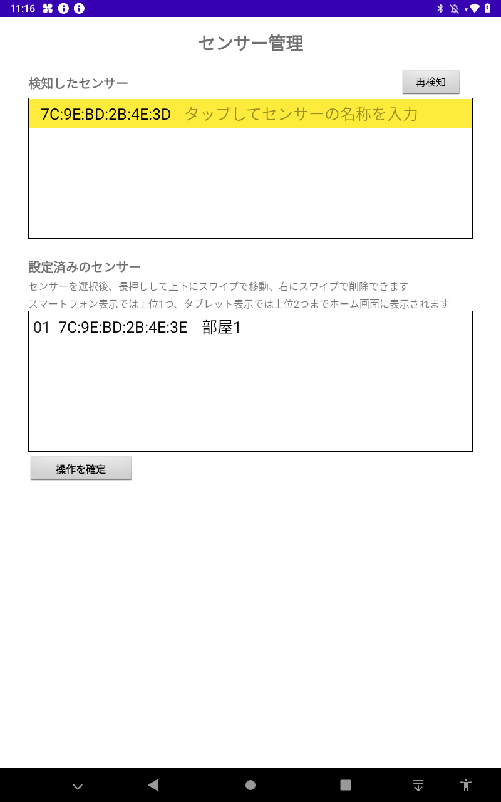

## About ClosedBuster

[With a few exceptions, the English text is behind the whole Japanese text.](#overview-1)

## Overview
CO2センサーで「密閉」を検知し、通知・換気などを行うアプリ

## Description
CO2センサーからのIBI(Iflink Beacon Interface)形式のデータをBLEアドバタイズで受信し、CO2濃度を描画します。 
CO2濃度の他にも、気温・湿度・気圧・人感判断（人がいるかの判別）を描画します。 
このアプリは単独でも動作しますが、IAI(Iflink Application Interface)形式でセンサーデータのIntentをBroadcast送信している為、ifLinkとIAI-IMSがインストールされている場合、ifLinkへデータ連携する事ができます。 
※IAI、IBIの詳細についてはこの後の章を参照 
[デバイスサービスのxmlファイルについてはこちらを参照](https://github.com/ifLinkOpenCommunity/ClosedBuster/raw/main/device-service/device_service_closedbuster.xml) 

## Screenshots

#### CO2濃度「低」
 

#### CO2濃度「中」
 

#### CO2濃度「高」
 

#### スマートフォン表示

#### 設定画面

#### センサー管理画面

## Requirement
- Android Studio 3.6.2
- Android SDK 29
- Android Build Tools v29.0.3

## Build
Gradleビルドシステムを使用しています。
1. Android Studioを起動し、"Open an existing Android Studio project"でフォルダを選択します。
2. "Make Project"でアプリをビルドします。
3. "Run'app'"でアプリを実行します。

## Usage
利用時は、BluetoothをONにしてください。 
初回アプリを起動時、位置情報とストレージの権限をすべて許可してください。 
デフォルトは表示モードが10インチタブレットとなっていますので、スマートフォンで利用する時は設定画面から表示モードを変更してください。 

事前にセンサー管理画面にてCO2センサーを登録する必要があります。 
左上のメニューボタンを押すか画面左側をスワイプしてメニューを表示し、センサー管理画面に遷移します。 
（なお、設定画面もこのメニューから遷移できます） 
> ※デバッグ用に未登録のセンサーを描画するモードを用意しています。 
> 　設定画面でONにすることで、１番目のセンサーとしてデータを描画します。 
> 　但し描画が不安定ですので、あくまで動作確認用としてご利用ください。 

センサー管理画面では、再検知ボタンを押すと検知したセンサーが上部の欄に表示されます。 
センサーをタップするとダイアログが表示されるので、名称を入力してOKすると下部の欄に移動します。 
その状態で操作を確定ボタンを押すと、センサー情報が登録されます。 
設定済みのセンサーは下部の欄から名称変更、表示順変更、削除などが可能です。
なお、スマートフォンの表示モードでは上位1つ、タブレットの表示モードでは上位2つまでホーム画面に表示されます。 
> センサー情報は以下の設定ファイルに記録されています 
> /Android/data/jp.iflink.closed_buster/files/sensors.xml 
> [sensors.xmlの書式についてはこちらを参照](https://github.com/ifLinkOpenCommunity/ClosedBuster/raw/main/SampleSettings/sensors.xml) 

アプリを起動している間、CO2センサーからデータを受信して画面に描画すると共に、ifLinkへデータ送信し、グラフデータを5分毎に記録します。 
画面描画の更新は5秒毎、ifLinkへでのデータ送信は30秒毎に行っています。 
描画更新間隔およびデータ送信間隔は、設定画面から変更可能です。 
データ受信、グラフデータの記録、ifLinkへのデータ送信はアプリがバックグラウンドになっても行われています。 
また、設定画面にてバックグラウンドで動作する設定に変更すると、アプリを終了しても動作し続けるようになります。 

画面下半分には個々のセンサーのCO2濃度と、CO2濃度に応じて評価を３段階の「高」「中」「低」で表示しています。 
また、直近１時間のCO2濃度の推移を折れ線グラフで表示しています。 
グラフには実際の数値が緑色の線で、閾値となる補助線がオレンジ色で引かれており、この補助線を超えると換気のタイミングとなり、換気を促すメッセージを表示する仕組みです。 
人感ありの時はタイトルバーの部分に色を付け、人感無しで1分経つとタイトルバーを灰色にして知らせるようにしています。 
（スマートフォンの表示モードでは、人型のアイコンで示しています。人感ありの時は塗りつぶされたアイコン、人感無しの時は輪郭だけのアイコンで表示します。） 
人感無し判定時間(1分)は設定画面から変更可能です。 

画面上半分にはCO2濃度が一番高いセンサー値を表示しており、「高」「中」「低」の評価と状態がひと目で判るように表示しています。 
このCO2濃度が一番高いセンサー値情報がifLinkに送信されます。 
なお、「高」「中」のCO2濃度の基準については、厚生労働省と文部科学省から出ている環境衛生基準から定めています。 

> 【参照】厚生労働省の建築物環境衛生管理基準（1000ppm以下） 
> https://www.mhlw.go.jp/bunya/kenkou/seikatsu-eisei10 
> 【参照】文部科学省の学校環境衛生基準（1500ppm以下） 
> https://www.mext.go.jp/a_menu/kenko/hoken/1292482.htm 

これらの基準値は設定画面から変更可能です。 

CO2センサーがOFFになってデータが届かない状態が3分続くと、センサー値をクリアして背景色を灰色にします。 
センサーOFF判定時間(3分)は設定画面から変更可能です。 

設定画面の表示モードの設定により、10インチタブレット、8インチタブレット、スマートフォンで表示を切り替えられるようになっています。 
タブレットの表示モードは、主に店舗に据え置きで設置してCO2濃度を監視する用途を想定しています。 
スマートフォンの表示モードは、持ち運びが容易なスマートフォンでCO2濃度を確認する用途を想定しており、グラフ描画機能を除いたり出来るだけ電池消費を抑えるように工夫しています。 

## About IBI (Iflink Beacon Interface)
ifLinkの標準的なビーコン通信形式です。ライブラリとIMSが公開されています。 
IBIライブラリを使用する事で、IBI形式で通信するデバイスなら容易にifLinkと連携できるようになっています。 
以下の特徴があります。 
- ペアリングが不要（BLEのアドバタイズで送信）
- 送達確認が可能（送信後、受信側からの応答を待つ機能）
- 識別子とフラグを除いて、20byteのユーザデータを送信可能
- データ型を指定可能（int, float, double, string, binary）

ClosedBusterでは、デフォルトで以下のIBIフォーマットのデータを受信します。 
- CompanyCode: 0x09AF
- IBIメンバーID: 55
- IBIモジュールID: 1
IBIメンバーIDとIBIモジュールIDについては、設定画面から変更が可能です。 

## About IAI (Iflink Application Interface)
ifLinkの標準的なアプリ間通信形式です。ライブラリとIMSが公開されています。 
IAIライブラリを使用する事でIAI形式で通信できる為、容易にifLinkと連携できるようになっています。 
以下の特徴があります。 
- 既存のアプリにifLinkとの通信部分を疎結合で後付けできる
- IMSのプロセスがアプリの外にあるので、動作が安定している
- IMSと違って自動起動しないので、UIのあるアプリに適している

## Depends
このアプリはAndroid OS 7.0～10.0に対応しています。 
This app is Compatible with Android OS 7.0 to 10.0. 
以下のライブラリを使用しています。 
The following libraries are used in this app. 
- Gaugelibrary v0.2.2
- MPAndroid Chart v3.0.3
- Gson v2.8.6
- Commons Codec v1.3

## Released Application
ソースをビルドしたAPKファイルは以下からDLできます。 
Here is a apk file which built from the source code. 
[Releases/download/ClosedBuster_v112.apk](https://github.com/ifLinkOpenCommunity/ClosedBuster/releases/download/v1.1.2/ClosedBuster_v112.apk)

## Community
リクエスト、質問、バグリポートがある場合、GitHubのissue機能を使用して下さい。

## Overview
An app that uses a CO2 sensor to detect "closing environment" and provide notifications, ventilation, etc.

## Description
It receives data in IBI(Iflink Beacon Interface) format from the CO2 sensor via BLE advertisement and draws the CO2 concentration. 
In addition to CO2 concentration, it also draws temperature, humidity, barometric pressure, and motion detection (to determine if someone is present). 
This app can work alone, since it broadcasts the Intent of sensor data in IAI(Iflink Application Interface) format, but ifLink and IAI-IMS are installed, it can link data to ifLink. 
*See subsequent chapters for more information on IAI and IBI 
[For more information about the xml file of device service, see here](https://github.com/ifLinkOpenCommunity/ClosedBuster/raw/main/device-service/device_service_closedbuster.xml) 

## Build
The Gradle build system is used.
1. Launch Android Studio and select a folder under "Open an existing Android Studio project".
2. Build your app with "Make Project".
3. "Run 'app'" to run the app.

## Usage
Please turn on Bluetooth when you use it. 
When launching the app for the first time, please allow all location and storage permissions. 
By default, the layout mode is set to 10" tablet, so please change the layout mode from the Setting screen when using a smartphone. 

You have to register the CO2 sensor on the Sensor setting screen in advance. 
Press the menu button in the upper left corner or swipe the left side of the screen to display the menu and go to the Sensor setting screen. 
(You can also access the Setting screen from this menu) 
> A mode to draw unregistered sensors is provided for debugging purposes. 
> By turning it on in the Setting screen, the data will be drawn as the first sensor. 
> But the rendering is unstable, so please use it only for validation. 

In the Sensor setting screen, tap Detect button to show the detected sensors in the upper field. 
When you tap a sensor, a dialog will appear. Enter its name and OK to sensor moves to the bottom field. 
In that state, press the "Confirm Operation" button to register the sensor information. 
You can rename, change the display order, or delete the configured sensors from the bottom field. 
Note that the sensors of the top one when the smartphone layout and the top two when the tablet layout that will be displayed on the home screen. 
> Sensor information is recorded in the following configuration file 
> /Android/data/jp.iflink.closed_buster/files/sensors.xml 
> [For more information about the format of sensors.xml, see here](https://github.com/ifLinkOpenCommunity/ClosedBuster/raw/main/SampleSettings/sensors.xml) 

While the app is running, it receives data from the CO2 sensor and draws it on the screen, send data to ifLink, and records the graph data every 5 minutes. 
The screen drawing is updated every 5 seconds, and the data is sent to ifLink every 30 seconds. 
The screen update interval and send data interval can be changed from the Setting screen. 
Data reception, graph data recording, and send data to ifLink are still working when the app is in the background. 
Also, if you change the setting to run in background in the Setting screen, it will continue to run even after you close the app. 

The lower half of the screen shows the CO2 concentration of the individual sensors and the rating in three levels of "High","Middle" and "Low" according to the CO2 concentration. 
In addition, a line graph of the transition of CO2 concentration for the last hour is shown. 
The graph has a green line for the actual value and an orange auxiliary line for the threshold value, and when this auxiliary line is crossed, it is time to ventilate and a message is displayed to encourage ventilation. 
When the motion detected then the title bar is colored, and no motion detected and 1 minute has passed then the title bar is grayed out to let you know. 
(indicated by a human-shaped icon when the smartphone layout. As a filled icon when the motion detected, as only an outline icon when no motion detected.) 
Time to judge as no motion (1 minute) can be changed from the Setting screen. 

The upper half of the screen shows the highest sensor value of CO2 concentration among all sensors, and its rating of "High","Middle" and "Low" and status are displayed so that they can be understood at a glance. 
This sensor value information with the highest CO2 concentration will be sent to ifLink. 
In addition, the standards for "High" and "Middle" CO2 concentrations are based on the environmental hygiene standards issued by the MHLW(厚生労働省) and the MEXT(文部科学省). 

> [ref] MHLW's Building environmental hygiene management standards (1000ppm or less) 
> https://www.mhlw.go.jp/bunya/kenkou/seikatsu-eisei10 
> [ref] MEXT's School environmental hygiene standards (1500ppm or less) 
> https://www.mext.go.jp/a_menu/kenko/hoken/1292482.htm 

These reference values can be changed from the Setting screen. 

If the CO2 sensor is turned off and no data is received for 3 minutes, the sensor value will be cleared and the background color will turn gray. 
Time to judge as Sensor off (3 minute) can be changed from the Setting screen. 

The screen layout can be switched between 10" tablet, 8" tablet, or smartphone by setting the layout mode in the Setting screen. 
The tablet's layout mode is mainly intended for stationary installation in stores to monitor CO2 concentration. 
The smartphone layout mode is designed for use in checking CO2 concentrations on a portable smartphone, excluding the graph drawing function and reducing battery consumption as much as possible. 

## About IBI (Iflink Beacon Interface)
This is the standard beacon communication format for ifLink. The library and IMS are publicly available. 
By using the IBI library, any device that communicates in IBI format can be easily linked to ifLink. 
IBI has the following features. 
- No pairing required (transmitted via BLE advertisements)
- Sending confirmation is possible (a function that waits for a response from the receiver after sending).
- 20 bytes of user data can be sent, excluding identifiers and flags.
- Data type can be specified (int, float, double, string, binary)

ClosedBuster receives data in the following IBI format by default. 
- CompanyCode: 0x09AF
- IBI MemberID: 55
- IBI ModuleID: 1
The IBI MemberID and IBI ModuleID can be changed from the Setting screen. 

## About IAI (Iflink Application Interface)
This is the standard ifLink inter-app communication format. The library and IMS are publicly available. 
By using the IAI library, apps can communicate in IAI format, so it can be easily linked to ifLink. 
IAI has the following features. 
- The communication part with ifLink can be retrofitted to the existing application with loose coupling.
- The operation is stable because the IMS process is outside the appx
- Unlike IMS, it does not start automatically, so it is suitable for apps with UI.

## Community
If you have a request, question, or bug report, please use the issue feature on GitHub.

## License
[MIT](./LICENSE)

## Disclaimer
The application registered in this repository is a sample of the result of building the source code, and it is not different from the content of the source code. 
For details of the applications registered in this repository and how to use them, please refer to the instructions in the README. 
Please use this application after confirming and agreeing to the following terms and conditions. 

By using this application, you agree to be bound by this disclaimer. 
Users are responsible for downloading and using this application. 
ifLink Open Community shall not be liable for any damage (whether tangible or intangible) caused by the use of this application. 
Please use the site at your own risk. 
ifLink Open Community makes no legal guarantee to the User of the accuracy, usefulness, timeliness or appropriateness of any information provided in the Application.

## Link
[ifLink](https://iflink.jp/)

