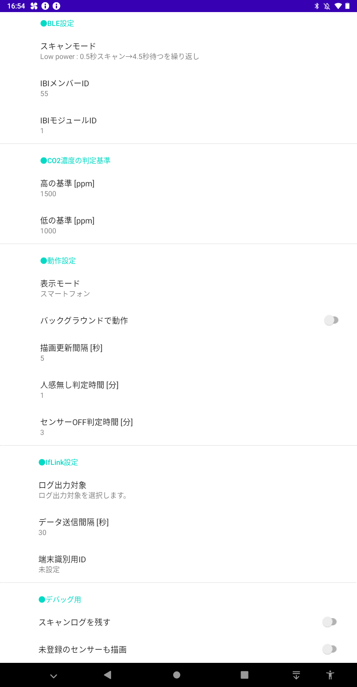

## About ClosedBuster

[English text follows the Japanese text.](#overview-1)

## Overview
CO2センサーで「密閉」を検知し、通知・換気などを行うアプリ

## Description
CO2センサーからのIBI(Iflink Beacon Interface)形式のデータをBLEアドバタイズで受信し、CO2濃度を描画します。 
CO2濃度の他にも、気温・湿度・気圧・人感判断（人がいるかの判別）を描画します。 
このアプリは単独でも動作しますが、IAI(Iflink Application Interface)形式でセンサーデータのIntentをBroadcast送信している為、ifLinkとIAI-IMSがインストールされている場合、ifLinkへデータ連携する事ができます。 
※IAI、IBIの詳細についてはこの後の章を参照 
[デバイスサービスのxmlファイルについてはこちらを参照](https://github.com/ifLinkOpenCommunity/ClosedBuster/raw/main/device-service/device_service_closedbuster.xml) 

## Screenshots

#### CO2濃度「低」
 

#### CO2濃度「中」
 

#### CO2濃度「高」
 

#### スマートフォン表示

#### 設定画面

## Requirement
- Android Studio 3.6.2
- Android SDK 29
- Android Build Tools v29.0.3

## Build
Gradleビルドシステムを使用しています。
1. Android Studioを起動し、"Open an existing Android Studio project"でフォルダを選択します。
2. "Make Project"でアプリをビルドします。
3. "Run'app'"でアプリを実行します。

## Usage
事前にCO2センサーのBDアドレスと名称(room)を設定ファイルsensors.xmlに定義する必要があります。 
[sensors.xmlの書式についてはこちらを参照](https://github.com/ifLinkOpenCommunity/ClosedBuster/raw/main/SampleSettings/sensors.xml) 
内部ストレージの以下の場所にsensors.xmlを作成し、配置してください。 
/Android/data/jp.iflink.closed_buster/files 
> ※デバッグ用に未定義のセンサーを描画するモードを用意しています。 
> 　設定画面でONにすることで、１番目のセンサーとしてデータを描画します。 
> 　描画が不安定ですので、あくまでテスト用途としてご利用ください。 

利用時は、BluetoothをONにしてください。 
アプリを起動している間、CO2センサーからデータを受信して画面に描画すると共に、ifLinkへデータ送信し、グラフデータを5分毎に記録します。 
画面描画の更新は5秒毎、ifLinkへでのデータ送信は30秒毎に行っています。 
描画更新間隔およびデータ送信間隔は、設定画面から変更可能です。 
データ受信、グラフデータの記録、ifLinkへのデータ送信は画面を閉じても行われています。 
また、設定画面にてバックグラウンドで動作する設定に変更すると、アプリを終了しても動作し続けるようになります。 
 
画面下半分には個々のセンサーのCO2濃度と、CO2濃度に応じて評価を３段階の「高」「中」「低」で表示しています。 
また、直近１時間のCO2濃度の推移を折れ線グラフで表示しています。 
グラフには実際の数値が緑色の線で、閾値となる補助線がオレンジ色で引かれており、 
この補助線を超えると換気のタイミングとなり、換気を促すメッセージを表示する仕組みです。 
人感ONの時はタイトルバーの部分に色を付け、人感OFFで1分経つとタイトルバーを灰色にして知らせるようにしています。 
なお、人感OFF判定時間(1分)は設定画面から変更可能です。 
 
画面上半分にはCO2濃度が一番高いセンサー値を表示しており、「高」「中」「低」の評価と状態がひと目で判るように表示しています。 
ifLinkと連携するときは、このCO2濃度が一番高いセンサー値情報を送るようにしています。 
なお、「高」「中」のCO2濃度の基準については、厚生労働省と文部科学省から出ている環境衛生基準から定めています。 
【参照】厚生労働省の建築物環境衛生管理基準（1000ppm以下） 
https://www.mhlw.go.jp/bunya/kenkou/seikatsu-eisei10 
【参照】文部科学省の学校環境衛生基準（1500ppm以下） 
https://www.mext.go.jp/a_menu/kenko/hoken/1292482.htm 
これらの基準値は設定画面から変更可能です。 
 
CO2センサーがOFFになってデータが届かない状態が3分続くと、センサー値をクリアして背景色を灰色にします。
なお、センサーOFF判定時間(3分)は設定画面から変更可能です。 
 
設定画面のレイアウトモードの設定により、10インチタブレット、8インチタブレット、スマートフォンで表示を切り替えられるようになっています。 
タブレットの表示モードは、主に店舗に据え置きで設置してCO2濃度を監視する用途を想定しています。 
スマートフォンの表示モードは、持ち運びが容易なスマートフォンでCO2濃度を確認する用途を想定しており、 
グラフ描画機能を除いたり出来るだけ電池消費を抑えるように工夫しています。 

## About IBI (Iflink Beacon Interface)
ifLinkの標準的なビーコン通信形式です。ライブラリとIMSが公開されています。 
IBIライブラリを使用する事で、IBI形式で通信するデバイスなら容易にifLinkと連携できるようになっています。 
以下の特徴があります。 
- ペアリングが不要（BLEのアドバタイズで送信）
- 送達確認が可能（送信後、受信側からの応答を待つ機能）
- 識別子とフラグを除いて、20byteのユーザデータを送信可能
- データ型を指定可能（int, float, double, string, binary）
 
ClosedBusterでは、以下のIBIフォーマットのデータを受信する仕組みとなっています。 
- CompanyCode: 0x09AF
- MemberId: 0x0037
- ModuleId: 0x0001

## About IAI (Iflink Application Interface)
ifLinkの標準的なアプリ間通信形式です。ライブラリとIMSが公開されています。 
IAIライブラリを使用する事で、IAI形式で通信するアプリなら容易にifLinkと連携できるようになっています。 
以下の特徴があります。 
- 既存のアプリにifLinkとの通信部分を疎結合で後付けできる
- IMSのプロセスがアプリの外にあるので、動作が安定している
- IMSと違って自動起動しないので、UIのあるアプリに適している

## Depends
このアプリでは以下のライブラリを使用しています。
- Gson
- MPAndroid Chart

Android OS 7.0以降に対応しています。

## Sample Application
ソースコードをビルドしたサンプルアプリケーションを登録しています。 
[SampleApplication/ClosedBuster_v100.apk](https://github.com/ifLinkOpenCommunity/ClosedBuster/raw/main/SampleApplication/ClosedBuster_v100.apk)

## Community
リクエスト、質問、バグリポートがある場合、GitHubのissue機能を使用して下さい。

## Overview

## Description

## Build

## About CO2 Sensor

## Usage

## About IBI (Iflink Beacon Interface)

## About IAI (Iflink Application Interface)

## Depends

## Sample Application

## Community

## License
[MIT](./LICENSE)

## Disclaimer
The application registered in this repository is a sample of the result of building the source code, and it is not different from the content of the source code. 
For details of the applications registered in this repository and how to use them, please refer to the instructions in the README. 
Please use this application after confirming and agreeing to the following terms and conditions. 

By using this application, you agree to be bound by this disclaimer. 
Users are responsible for downloading and using this application. 
ifLink Open Community shall not be liable for any damage (whether tangible or intangible) caused by the use of this application. 
Please use the site at your own risk. 
ifLink Open Community makes no legal guarantee to the User of the accuracy, usefulness, timeliness or appropriateness of any information provided in the Application.

## Link
[ifLink](https://iflink.jp/)

